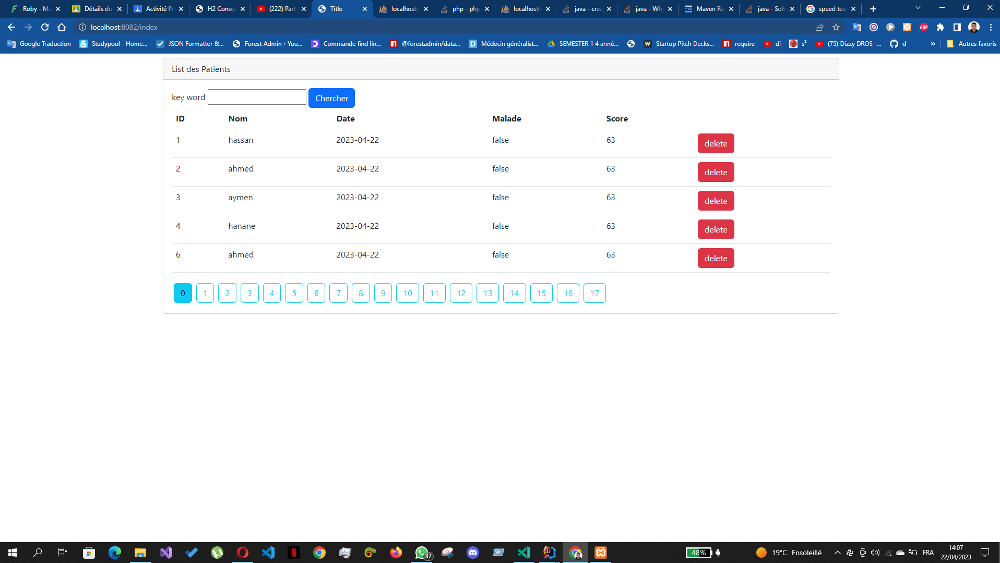

<h1>activités 3 : spring mvc  avec thymeleaf</h1>

<h3>
Afficher les patients
Faire la pagination
Chercher les patients
Supprimer un patient
Faire des améliorations supplémentaires
</h3>

<h3>
  Chercher les patients par nom  "hassan"
</h3>
